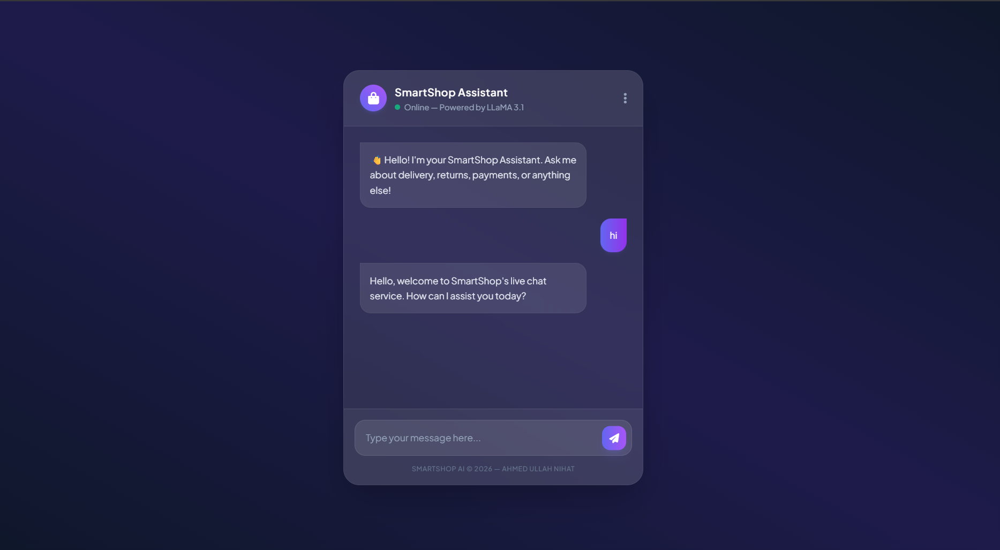
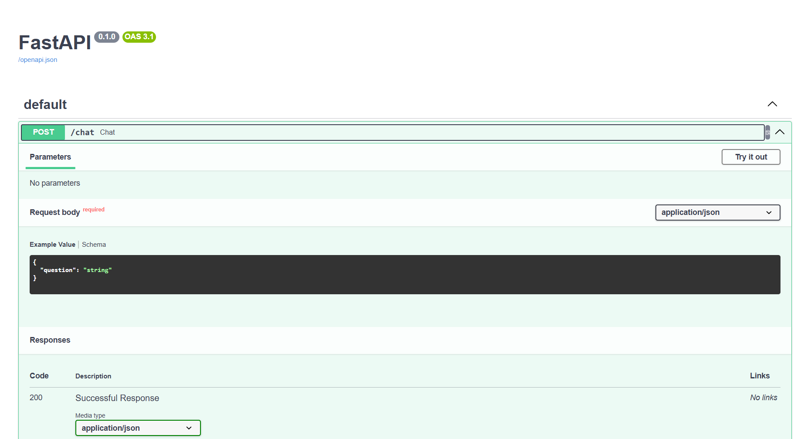

<div align="center">

```
███████╗███╗   ███╗ █████╗ ██████╗ ████████╗███████╗██╗  ██╗ ██████╗ ██████╗ 
██╔════╝████╗ ████║██╔══██╗██╔══██╗╚══██╔══╝██╔════╝██║  ██║██╔═══██╗██╔══██╗
███████╗██╔████╔██║███████║██████╔╝   ██║   ███████╗███████║██║   ██║██████╔╝
╚════██║██║╚██╔╝██║██╔══██║██╔══██╗   ██║   ╚════██║██╔══██║██║   ██║██╔═══╝ 
███████║██║ ╚═╝ ██║██║  ██║██║  ██║   ██║   ███████║██║  ██║╚██████╔╝██║     
╚══════╝╚═╝     ╚═╝╚═╝  ╚═╝╚═╝  ╚═╝   ╚═╝   ╚══════╝╚═╝  ╚═╝ ╚═════╝ ╚═╝     
                                                              A S S I S T A N T
```

**AI-Powered E-Commerce Chatbot**

*Retrieval-Augmented Generation · LLaMA 3.1 · ChromaDB · FastAPI*

<br/>

[](https://smartshopchat.netlify.app)&nbsp;
[](https://smartshop-assistant-basic-production.up.railway.app/docs)&nbsp;
[](https://python.org)&nbsp;
[](https://fastapi.tiangolo.com)&nbsp;
[](https://docker.com)&nbsp;
[](LICENSE)

</div>

---

## Overview

**SmartShop Assistant** is a production-grade, AI-powered chatbot that transforms static PDF policy documents into an intelligent, queryable knowledge base. Built on a full **Retrieval-Augmented Generation (RAG)** pipeline, it delivers precise, context-grounded answers to customer queries in real time — no hallucinations, no guesswork.

The system ingests business documents, encodes them into semantic vectors, stores them in ChromaDB, and retrieves the most relevant context on demand — feeding it to **LLaMA 3.1 via Groq** for sub-second, grounded responses. Exposed through a clean **FastAPI** REST interface and a polished frontend, it is fully containerized and cloud-deployed.

> This is not a toy chatbot. It is a deployable, scalable AI customer support system.

---

## Features

| | Capability | Description |
|---|---|---|
| `PDF` | **Document Ingestion** | Loads and chunks policy documents into semantically meaningful segments |
| `VEC` | **Semantic Search** | ChromaDB vector store with HuggingFace embeddings for high-accuracy retrieval |
| `LLM` | **LLaMA 3.1 via Groq** | Sub-second inference with context-grounded, hallucination-resistant responses |
| `API` | **FastAPI Endpoint** | Production-ready REST API with auto-generated Swagger documentation |
| `RAG` | **Full RAG Pipeline** | LangChain LCEL chain connecting retrieval → prompting → generation |
| `CTR` | **Containerized** | Docker-ready deployment for Railway, AWS, GCP, or any cloud platform |
| `CLI` | **Terminal Chatbot** | Interactive CLI mode for rapid local testing and development |
| `WEB` | **Frontend UI** | Clean web interface deployed on Netlify for end-user interaction |

---

## ◈ System Architecture

```
┌─────────────────────────────────────────────────────────────────┐
│                        USER QUERY                               │
└────────────────────────────┬────────────────────────────────────┘
                             │
                             ▼
┌─────────────────────────────────────────────────────────────────┐
│  INGESTION LAYER                                                │
│  ┌──────────────┐    ┌───────────────┐    ┌──────────────────┐  │
│  │  PDF Loader  │───▶│ Text Chunker  │───▶│  HuggingFace     │  │
│  │  (PyMuPDF)   │    │ (LangChain)   │    │  Embeddings      │  │
│  └──────────────┘    └───────────────┘    └────────┬─────────┘  │
└────────────────────────────────────────────────────┼────────────┘
                                                     │
                                                     ▼
┌─────────────────────────────────────────────────────────────────┐
│  RETRIEVAL LAYER                                                │
│                  ┌─────────────────────┐                        │
│                  │   ChromaDB           │                        │
│                  │   Vector Store       │                        │
│                  │   (Persistent)       │                        │
│                  └──────────┬──────────┘                        │
│                             │ Semantic Retrieval (Top-K)         │
└─────────────────────────────┼───────────────────────────────────┘
                              │
                              ▼
┌─────────────────────────────────────────────────────────────────┐
│  GENERATION LAYER                                               │
│  ┌────────────────────┐         ┌────────────────────────────┐  │
│  │  LangChain LCEL    │────────▶│   Groq API                 │  │
│  │  Chain             │         │   LLaMA 3.1 (70B)          │  │
│  └────────────────────┘         └────────────────────────────┘  │
└────────────────────────────────────────────────────────────────┘
                              │
                              ▼
                  ┌───────────────────────┐
                  │   Grounded Answer     │
                  │   → User / API / UI   │
                  └───────────────────────┘
```

---

## ◈ Tech Stack

<div align="center">

| Layer | Technology | Role |
|---|---|---|
| 🔗 **Orchestration** | LangChain + LCEL | RAG pipeline construction and chaining |
| 🗄️ **Vector Store** | ChromaDB | Persistent semantic vector storage |
| 🧠 **LLM** | Groq → LLaMA 3.1 (70B) | Ultra-fast language model inference |
| 🔢 **Embeddings** | HuggingFace Sentence Transformers | Text-to-vector encoding |
| 🚀 **API** | FastAPI + Uvicorn | Production REST endpoint |
| 🐳 **Containers** | Docker | Environment isolation and portability |
| ☁️ **Backend Host** | Railway | Cloud API deployment |
| 🌐 **Frontend Host** | Netlify | Static frontend deployment |
| 🐍 **Language** | Python 3.11 | Core runtime |

</div>

---

## ◈ Project Structure

```
smartshop-assistant-basic/
│
├── 07_langchain_rag.py       ─── Manual RAG pipeline (base implementation)
├── 08_pdf_rag.py             ─── PDF-powered RAG pipeline + terminal chatbot
├── 09_fastapi_chat.py        ─── FastAPI REST endpoint (production server)
│
├── index.html                ─── Frontend chatbot UI
│
├── smartshop_policy.pdf      ─── Knowledge base document
│
├── Dockerfile                ─── Container configuration
├── requirements.txt          ─── Python dependencies
└── .gitignore
```

---

## ◈ Installation Guide

### Prerequisites

```
✦ Python 3.11+
✦ pip (package manager)
✦ Git
✦ Docker (optional, for containerized deployment)
✦ Groq API Key → https://console.groq.com
```

---

### Step 1 — Clone the Repository

```bash
git clone https://github.com/AhmedNihat/smartshop-assistant-basic.git
cd smartshop-assistant-basic
```

---

### Step 2 — Create a Virtual Environment

```bash
# Create environment
python -m venv venv

# Activate (Windows)
venv\Scripts\activate

# Activate (macOS / Linux)
source venv/bin/activate
```

---

### Step 3 — Install Dependencies

```bash
pip install -r requirements.txt
```

---

### Step 4 — Configure Environment Variables

Create a `.env` file in the project root:

```bash
# .env
GROQ_API_KEY=your_groq_api_key_here
```

> ⚠️ **Never commit your `.env` file.** It is listed in `.gitignore` by default.
> Get your free Groq API key at [console.groq.com](https://console.groq.com).

---

## ◈ Usage

### ◦ Terminal Chatbot (Local Mode)

Run the interactive CLI chatbot directly in your terminal:

```bash
python 08_pdf_rag.py
```

```
> You: What is the return policy?
> SmartShop: SmartShop accepts returns within 7 calendar days of delivery.
             Items must be unused and in original packaging...
```

---

### ◦ REST API Server

Start the FastAPI production server:

```bash
uvicorn 09_fastapi_chat:app --reload --host 0.0.0.0 --port 8000
```

Access the auto-generated Swagger UI at:

```
http://localhost:8000/docs
```

---

### ◦ Docker Deployment

```bash
# Build the image
docker build -t smartshop-api .

# Run the container
docker run -p 8000:8000 -e GROQ_API_KEY=your_groq_api_key smartshop-api
```

---

## ◈ API Reference

### `POST /chat`

Send a customer query and receive a grounded, context-aware response.

**Request Body**

```json
{
  "question": "What is the return policy?"
}
```

**Response**

```json
{
  "answer": "SmartShop accepts returns within 7 calendar days of the delivery date. The item must be unused, in its original packaging, and accompanied by proof of purchase. Refunds are processed within 3–5 business days."
}
```

**cURL Example**

```bash
curl -X POST "https://smartshop-assistant-basic-production.up.railway.app/chat" \
     -H "Content-Type: application/json" \
     -d '{"question": "Do you offer free shipping?"}'
```

**Live Swagger UI:** [railway.app/docs](https://smartshop-assistant-basic-production.up.railway.app/docs)

---

## ◈ Configuration

| Variable | Required | Description |
|---|---|---|
| `GROQ_API_KEY` | ✅ Yes | Your Groq API key for LLaMA 3.1 inference |
| `CHROMA_PERSIST_DIR` | ❌ Optional | Custom path for ChromaDB persistence (default: `./chroma_db`) |
| `EMBED_MODEL` | ❌ Optional | HuggingFace embedding model name (default: `all-MiniLM-L6-v2`) |
| `TOP_K_RESULTS` | ❌ Optional | Number of retrieved chunks per query (default: `4`) |
| `PORT` | ❌ Optional | API server port for Docker deployment (default: `8000`) |

---
## ◈ Screenshots / Demo

<div align="center">

### 1. Frontend Chatbot UI


### 2. Swagger UI - API Documentation



</div>

**🌐 Live Demo:** [smartshopchat.netlify.app](https://smartshopchat.netlify.app)  
**🔌 API Docs:** [Railway Swagger](https://smartshop-assistant-basic-production.up.railway.app/docs)

**🌐 Live:** [smartshopchat.netlify.app](https://smartshopchat.netlify.app) &nbsp;|&nbsp; **🔌 API:** [Railway Deployment](https://smartshop-assistant-basic-production.up.railway.app/docs)

</div>

---

## ◈ Contributing

Contributions are welcome and appreciated. Please follow these guidelines:

**1. Fork & Clone**
```bash
git clone https://github.com/YOUR_USERNAME/smartshop-assistant-basic.git
```

**2. Create a Feature Branch**
```bash
git checkout -b feature/your-feature-name
```

**3. Commit with Clear Messages**
```bash
git commit -m "feat: add multi-document ingestion support"
```

**4. Push and Open a Pull Request**
```bash
git push origin feature/your-feature-name
```

**Contribution Standards:**
- Follow existing code style and project structure
- Write clear, descriptive commit messages (conventional commits preferred)
- Add docstrings and inline comments where logic is non-trivial
- Test your changes before submitting a PR
- Open an issue first for major feature proposals

---

## ◈ Roadmap

- [ ] Multi-document ingestion (multiple PDFs simultaneously)
- [ ] Conversation memory / multi-turn dialogue support
- [ ] Admin dashboard for document management
- [ ] Authentication layer for the API
- [ ] Support for additional LLM providers (OpenAI, Anthropic)
- [ ] Streaming responses via WebSocket

---

## ◈ Author

<div align="center">

```
╔══════════════════════════════════════════════════════╗
║             AHMED ULLAH NIHAT                        ║
║    CSE Graduate · Premier University, Chittagong     ║
║         Aspiring ML / AI Engineer                    ║
╚══════════════════════════════════════════════════════╝
```

[](https://github.com/AhmedNihat)
[](https://linkedin.com/in/ahmed-ullah-ds)
[](mailto:ahmedullahnihat@gmail.com)
[](https://ahmednihat.xyz)

</div>

---

## ◈ License

```
MIT License

Copyright (c) 2025 Ahmed Ullah Nihat

Permission is hereby granted, free of charge, to any person obtaining a copy
of this software and associated documentation files (the "Software"), to deal
in the Software without restriction, including without limitation the rights
to use, copy, modify, merge, publish, distribute, sublicense, and/or sell
copies of the Software, and to permit persons to whom the Software is
furnished to do so, subject to the following conditions:

The above copyright notice and this permission notice shall be included in all
copies or substantial portions of the Software.

THE SOFTWARE IS PROVIDED "AS IS", WITHOUT WARRANTY OF ANY KIND, EXPRESS OR
IMPLIED, INCLUDING BUT NOT LIMITED TO THE WARRANTIES OF MERCHANTABILITY,
FITNESS FOR A PARTICULAR PURPOSE AND NONINFRINGEMENT.
```

---

<div align="center">

*Built with precision. Deployed with purpose.*

**SmartShop Assistant** · MIT License · [ahmednihat.xyz](https://ahmednihat.xyz)

</div>
